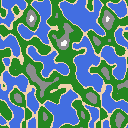

Here is the README translated into English:# Map Generator with Perlin Noise

This Python project generates procedural maps using Perlin noise. The maps consist of different zones such as water, beaches, grass, mountains, and snow, each represented by distinct colors.

## Features

- Generate procedural maps using Perlin Noise.
- Define biomes with specific colors: water, beach, grass, mountain, and snow.
- Save generated maps as PNG images.
- Use a random seed to create unique maps.

## Installation

1. Ensure Python is installed on your machine.
2. Install the required dependencies using the following command:

   ```bash
   pip install noise pillow numpy
   ```

## Usage

1. Run the Python script:

   ```bash
   python map_generation.py
   ```

2. An image named `noise.png` will be generated in the project directory.

3. The random seed used for generation will be displayed in the console, allowing you to recreate the same map if needed.

## Customization

You can modify the global parameters to adjust the map's characteristics:

- `shape`: Map dimensions (default `(128, 128)`).
- `scale`: Noise scale (default `25.0`).
- `octaves`: Number of noise layers (default `2`).
- `persistence`: Amplitude factor between layers (default `1.2`).
- `lacunarity`: Frequency factor between layers (default `2.0`).

## Examples

Here is an example of a generated map:



